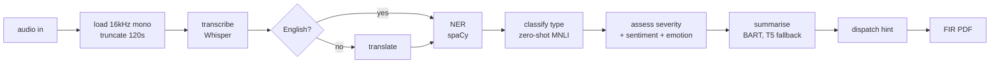

# NLP_FIR

**Turns an emergency call recording into a filed incident report.** Eight models,
CPU-only, no API keys, no external services.


Upload a `wav`, `mp3`, `m4a` or `ogg` file. Get back a transcript, a classified
emergency type, a severity assessment, extracted entities and a probable
location, a summary, a dispatch suggestion, and a printable FIR-style PDF.



---

## What it produces

From a single upload, in one pass:

| Output | How |
|---|---|
| **Transcript** | Whisper, with automatic language detection |
| **English translation** | Whisper's `translate` task, only when the detected language isn't English |
| **Emergency type** | Zero-shot classification over `medical / fire / police / accident` |
| **Severity** | `high / medium / low` — zero-shot, weighted with call sentiment and speaker emotion |
| **Entities** | spaCy NER over the transcript |
| **Probable location** | First `GPE`, `LOC` or `FAC` entity found |
| **Summary** | BART chunked with overlap, falling back to T5, suppressed entirely if the result carries no information |
| **Intent match** | Nearest known dispatcher command by sentence-embedding cosine similarity |
| **Dispatch suggestion** | Nearest station, units and ETA from the registry in `stations.json` |
| **FIR report** | A formatted PDF, one file per request |
| **Audio plots** | Waveform, MFCC and pitch contour, plus an entity-label distribution |

## Quick start

Needs Python 3.9+, **ffmpeg** (Whisper shells out to it), and ~6 GB free disk.

```bash
git clone https://github.com/CoderSoham/NLP_FIR.git && cd NLP_FIR
python3 -m venv .venv && source .venv/bin/activate
pip install -r requirements.txt
python -m spacy download en_core_web_sm
```

ffmpeg is a **system** package and is not in `requirements.txt`:

```bash
sudo apt install ffmpeg      # Debian/Ubuntu
brew install ffmpeg          # macOS
```

Then:

```bash
python app.py
```

Open `http://localhost:5000` and upload a file up to 25 MB.

**No sample audio ships with this repository.** `.gitignore` excludes `*.mp3`
and `*.wav`, deliberately — see [Data handling](#data-handling). Supply
your own recording, or use any public emergency-call training audio.

**The first request downloads roughly 4.5 GB** of model weights and will appear
to hang for several minutes. That is normal, and it happens once.

For anything beyond local use:

```bash
gunicorn -w 1 -t 300 app:app
```

**One worker, long timeout — both deliberate.** Each worker loads its own 4.5 GB
of weights, so `-w 4` needs roughly 18 GB of RAM. The pipeline runs inside the
request and takes tens of seconds on CPU, so a default 30 s timeout kills it
mid-transcription.

## How it works

`utils/audio_utils.py:process_audio_file` is the whole flow.

1. **Load** at 16 kHz mono — what Whisper expects — and **truncate to 120 s**.
   Long uploads otherwise dominate request time; the cap is deliberate.
2. **Visualise** — waveform, MFCC and pitch, written as PNGs.
3. **Transcribe** in one pass with language auto-detect. If the language isn't
   English, a second pass with `task='translate'` produces the English text that
   every downstream stage actually consumes.
4. **Extract entities**, before severity, because severity weighs them. Their
   label distribution is plotted here, once there are entities to plot.
5. **Classify type**, then **assess severity**. The zero-shot label distribution
   contributes 40%, negative sentiment 20%, distressed emotion 20%, and entity
   density 20%, capped.
6. **Summarise**, rejecting summaries that add nothing over the source.
7. **Suggest dispatch** by matching the location against area keywords in the
   station registry, falling back to the first station listed for the type.
8. **Render the PDF**, keyed to a per-request id.

### Models

Lazily loaded and cached in a module-level global — the first request pays, the
rest don't.

| Stage | Model | Approx. size |
|---|---|---|
| Transcription | `openai-whisper` (`base`, configurable) | 140 MB |
| Type + severity | `facebook/bart-large-mnli` | 1.6 GB |
| Summarisation | `facebook/bart-large-cnn` | 1.6 GB |
| Summary fallback | `t5-small` | 240 MB |
| Sentiment | `finiteautomata/bertweet-base-sentiment-analysis` | 540 MB |
| Emotion | `j-hartmann/emotion-english-distilroberta-base` | 330 MB |
| Embeddings | `all-MiniLM-L6-v2` | 90 MB |
| NER | spaCy `en_core_web_sm` | 12 MB |

One MNLI model backs both classification stages rather than two — see
[Design notes](docs/architecture.md#one-model-two-classifiers). Set `FORCE_CPU=0`
to use CUDA where the card can hold the weights.

## API

```bash
curl -F "audio_file=@call.mp3" http://localhost:5000/api/process
```

Returns the full analysis as JSON: transcript, language, type, severity,
entities, summary, sentiment, emotion, dispatch, and `report_id`.

| Route | Purpose |
|---|---|
| `GET /` | Upload form |
| `POST /` | Upload and render results |
| `POST /api/process` | Same pipeline, JSON response |
| | Upload routes are rate limited; `429` carries `Retry-After` |
| `GET /download_fir/<report_id>` | Fetch that request's PDF |
| `GET /plot/<report_id>/<kind>` | Fetch a plot from that request |
| `GET /audio/<filename>` | Serve an uploaded recording |
| `GET /healthz` | Liveness probe |

## Configuration

All of `config.py` reads from the environment.

| Variable | Default | |
|---|---|---|
| `WHISPER_MODEL_NAME` | `base` | `tiny` is ~3x faster; `small` / `medium` more accurate |
| `MAX_CONTENT_LENGTH` | 25 MB | Upload cap |
| `UPLOAD_FOLDER` | `storage/uploads` | Served only via `/audio/<name>` |
| `PROCESSED_FOLDER` | `storage/processed` | PDFs and plots |
| `FLASK_DEBUG` | `0` | |
| `STATIONS_FILE` | `stations.json` | Station registry used for dispatch |
| `FORCE_CPU` | `1` | Set `0` to use CUDA when available |
| `RETENTION_SECONDS` | `3600` | Age at which stored files are deleted |
| `RETENTION_SWEEP_SECONDS` | `300` | How often the sweeper runs |
| `RATE_LIMIT_REQUESTS` | `10` | Pipeline runs allowed per window, per caller |
| `RATE_LIMIT_WINDOW_SECONDS` | `600` | Length of that window |
| `TRUST_PROXY_HEADERS` | `0` | Set `1` only behind a proxy you control |
| `API_KEY` | unset | When set, upload routes require `X-API-Key` |


## Data handling

The input is emergency-call audio, so the defaults are conservative.

- **Uploads and generated artefacts are deleted after an hour.** A background
  sweeper runs every five minutes and on startup; both intervals are
  configurable.
- **Uploads live outside `static/`** and are reachable only through
  `/audio/<filename>`, which serves names this application generated and
  nothing else.
- **Plots and reports are keyed to the request that produced them** and served
  through validated routes, so one caller cannot reach another's artefacts.
- **Uploads are rate limited per caller**, and can be put behind an API key by
  setting `API_KEY`.
- **Nothing leaves the machine.** No API keys, no external calls, no telemetry.
  Model weights are fetched from HuggingFace on first run and cached locally.
- **No call audio or transcripts are distributed with this repository**, and
  `.gitignore` is written to keep it that way.

## Development

```bash
pip install -r requirements-dev.txt
pytest -q
```

The suite runs **without the ML stack installed** — it stubs the pipeline
module, so routes, templates, retention and plotting are covered in a couple of
seconds rather than downloading 4.5 GB of weights. CI runs it on 3.10, 3.11 and
3.12.

`scripts/explore.py` is a standalone script for poking at a recording outside
the app.

## Contributing

See [CONTRIBUTING.md](CONTRIBUTING.md). Security issues: [SECURITY.md](SECURITY.md).

## Licence

MIT — see [LICENSE](LICENSE).
