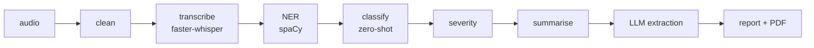

# NLP_FIR

Turn a recording of an emergency call into a structured incident report.


Upload an audio file and get back a transcript, the emergency type, a severity
assessment, extracted entities and location, a summary, a dispatch suggestion,
and a printable FIR-style PDF. It runs on your own machine — GPU if you have
one, CPU if you don't — and needs no API keys.



The classical NLP stages always run. The LLM stage is an enrichment on top: if
no model is available the pipeline still produces a complete result.

---

## Setup

### Requirements

- **Python 3.10–3.12**
- **~8 GB disk** for model weights, downloaded on first run. If your home
  directory is small, `cp .venvrc.example .venvrc`, set the paths and
  `source` it before installing.
- **Optional: an NVIDIA GPU.** Everything works on CPU, just slower.

No system packages are required. FFmpeg ships as a Python dependency.

### Install

```bash
git clone https://github.com/CoderSoham/NLP_FIR.git
cd NLP_FIR
python3 -m venv .venv && source .venv/bin/activate
pip install -r requirements.txt
```

That is the whole setup. The spaCy model and an FFmpeg binary are pinned
dependencies, so there is no separate download step.

### Run

```bash
python app.py
```

Open `http://localhost:5000` and upload a `wav`, `mp3`, `m4a` or `ogg` file.

The **first request downloads several GB of model weights** and will appear to
hang for some minutes. That happens once; afterwards they load from cache.

No sample audio ships with this repository — `.gitignore` excludes audio
deliberately, see [Handling call data](#handling-call-data). Use any recording
of your own.

## Free hosted models (recommended)

Both stages run locally by default and need no account. They also run
considerably better against hosted models, and both providers below have a
free tier that needs no payment details.

### NVIDIA — the language model

Used to read the transcript and fill the incident record.

1. Sign in at **[build.nvidia.com](https://build.nvidia.com)** (free NVIDIA
   Developer account)
2. Go to **[Settings → API Keys](https://build.nvidia.com/settings/api-keys)**,
   or open any model card and press **Get API Key**
3. **Generate API Key** — it begins `nvapi-` and is shown once

Free tier: no card, roughly 40 requests a minute.

### Groq — transcription

Serves `whisper-large-v3-turbo` far faster than most machines can run it, and
takes transcription off your GPU entirely.

1. Sign in at **[console.groq.com](https://console.groq.com)**
2. **[API Keys](https://console.groq.com/keys)** → **Create API Key**
3. It begins `gsk_` and is shown once

Free tier: no card, 2,000 requests and 28,800 audio-seconds a day.

### Configure

```bash
cp .env.example .env
```

```ini
LLM_BACKEND=nvidia
NVIDIA_API_KEY=nvapi-...

ASR_BACKEND=groq
GROQ_API_KEY=gsk_...
```

`.env` is gitignored. Real environment variables take precedence, so a
container or CI can supply them instead.

### Which model

The default is `nvidia/nemotron-3-ultra-550b-a55b`. To see what your account
actually serves — catalogues are a superset of what a given key can call, and
identifiers change:

```bash
python -m utils.llm_providers nvidia
```

### Other providers

`LLM_BACKEND` also accepts `groq`, `openrouter`, `cerebras`, `mistral`,
`anthropic`, `ollama` and `llamacpp` — anything speaking the OpenAI
chat-completions shape. `python -m utils.llm_providers` lists them.

> **A hosted provider receives your data.** The language model receives the
> transcript; hosted transcription receives **the audio itself**. Emergency-call
> recordings contain names, addresses, phone numbers and medical detail, and
> some free tiers train on what you submit. Both default to local for that
> reason, and `ollama` runs a quantised model on hardware `transformers` cannot
> use.

## Running it locally instead

No keys needed. `LLM_BACKEND=local` and `ASR_BACKEND=local` are the defaults.

```bash
FORCE_CPU=0 python app.py     # use CUDA where it is available
```

Device and quantisation are resolved from what the card reports as supported,
so an older GPU falls back to int8 rather than failing.

### Model sizes

`WHISPER_MODEL_NAME` chooses the speech model — `large-v3-turbo` on a GPU,
`base` on CPU, because turbo on CPU is slow.

### Choosing a local language model

`python -m utils.llm_hardware` inspects the machine and lists which models fit.

```bash
LOCAL_LLM_MODEL=Qwen/Qwen2.5-3B-Instruct python app.py
LOCAL_LLM_DEVICE=cpu python app.py          # bigger model, no VRAM limit
```

Only one large model is GPU-resident at a time — speech, classical NLP and the
language model take the card in turn. `GPU_EXCLUSIVE=0` keeps them all loaded
where there is room.

## API

```bash
curl -F "audio_file=@call.mp3" http://localhost:5000/api/process
```

| Route | |
|---|---|
| `GET /` | Upload form |
| `POST /` | Upload and render the report |
| `POST /api/process` | Same pipeline, JSON response |
| `GET /download_fir/<report_id>` | The generated PDF |
| `GET /plot/<report_id>/<kind>` | `waveform`, `mfcc`, `pitch` or `entities` |
| `GET /audio/<filename>` | An uploaded recording |
| `GET /healthz` | Liveness probe |

Upload routes are rate limited and return `429` with `Retry-After`.

---

## Configuration

Every setting is an environment variable, read in `config.py`.

| Variable | Default | |
|---|---|---|
| `FORCE_CPU` | `1` | `0` to use CUDA when available |
| `WHISPER_MODEL_NAME` | by device | Any faster-whisper model name |
| `ASR_COMPUTE_TYPE` | by device | `int8`, `float16`, `float32` |
| `LLM_BACKEND` | `auto` | `local`, `nvidia`, `groq`, `openrouter`, `anthropic`, `ollama`, `none` |
| `ASR_BACKEND` | `local` | `local` or `groq` |
| `NVIDIA_API_KEY` | unset | Enables `LLM_BACKEND=nvidia` |
| `GROQ_API_KEY` | unset | Enables `ASR_BACKEND=groq` and `LLM_BACKEND=groq` |
| `LLM_MODEL` | by provider | Override the provider's default model |
| `TRANSCRIPT_CACHE` | `storage/transcripts` | Cached transcripts, keyed by audio hash |
| `LOCAL_LLM_MODEL` | by hardware | Any instruct model on the Hub |
| `LOCAL_LLM_DEVICE` | by hardware | `cuda` or `cpu` |
| `ANTHROPIC_API_KEY` | unset | Enables the hosted backend |
| `GPU_EXCLUSIVE` | `1` | `0` keeps every model resident |
| `MAX_AUDIO_SECONDS` | `120` | Analysed prefix of a recording |
| `MAX_CONTENT_LENGTH` | 25 MB | Upload size cap |
| `RETENTION_SECONDS` | `3600` | Age at which stored files are deleted |
| `RATE_LIMIT_REQUESTS` | `10` | Uploads per window, per caller |
| `RATE_LIMIT_WINDOW_SECONDS` | `600` | Length of that window |
| `API_KEY` | unset | When set, uploads require `X-API-Key` |
| `STATIONS_FILE` | `stations.json` | Dispatch station registry |
| `UPLOAD_FOLDER` | `storage/uploads` | |
| `PROCESSED_FOLDER` | `storage/processed` | |

---

## Working on it

### Layout

```
app.py            Flask routes
config.py         Environment-backed settings
stations.json     Dispatch station registry — edit this, not the code
eval/             Evaluation harness, labels, stored results
utils/            Pipeline stages, one concern per module
tests/            Runs without the ML stack installed
```

`utils/audio_utils.py` orchestrates the pipeline and owns the models. Anything
testable without a model lives in its own module beside it.

### Evaluating a change

```bash
python -m eval.run --backend nvidia              # scores against eval/labels.json
python -m eval.run --backend local --model ...   # compare
```

Runs on saved transcripts, not audio, so comparing models costs no
transcription. Full extractions are written to `eval/results/`, so a scoring
change can be re-applied to past runs without calling a model again.

### Tests

```bash
pip install -r requirements-dev.txt
pytest -q
```

The suite **does not need torch, faster-whisper or spaCy**. `tests/conftest.py`
stubs the pipeline module, and the scoring, plotting, retention, dispatch and
LLM-plumbing logic all live in modules with no ML imports. It runs in a couple
of seconds, so it is worth running on every change.

CI runs it on 3.10, 3.11 and 3.12, and separately resolves `requirements.txt`
on each so a broken install cannot pass unnoticed.

### Adding a pipeline stage

Stages are ordinary functions called from `process_audio_file`. Two conventions:

- **Keep the logic out of `audio_utils`.** Anything testable without a model
  should be importable without one.
- **Return your uncertainty.** `dispatch` says whether it matched a location or
  fell back, `signals` says which words fired, ASR reports per-segment
  confidence. A result that hides its own weakness is the failure mode this
  codebase hits most often.

### Handling call data

Do not commit recordings or transcripts. `.gitignore` excludes `models/`,
`storage/` and common audio extensions, but check `git status` before staging.

Uploads and generated artefacts are deleted after `RETENTION_SECONDS`, and are
served only through routes that validate the request id.

---

## Contributing

See [CONTRIBUTING.md](CONTRIBUTING.md). Security reports: [SECURITY.md](SECURITY.md).
Design notes and the reasoning behind the pipeline: [docs/architecture.md](docs/architecture.md).

## Licence

Apache-2.0 — see [LICENSE](LICENSE) and [NOTICE](NOTICE). The model weights
downloaded at runtime carry their own licences, listed in `NOTICE`.
